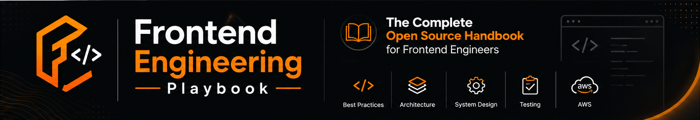

````markdown
<p align="center">
  
</p>

<h1 align="center">Frontend Engineering Playbook</h1>

<p align="center">
  <strong>Learn • Build • Interview • Architect • Lead</strong>
</p>

<p align="center">
  A practical open-source knowledge base for Frontend and Full Stack Engineers.
</p>

<p align="center">
  
</p>

---

# 📖 About

Frontend Engineering Playbook (FEP) is a comprehensive learning resource designed to help developers grow from beginner to lead engineer.

Instead of focusing only on interview questions, this repository emphasizes:

- Understanding core concepts
- Building production-ready applications
- Learning software architecture
- Solving real-world engineering problems
- Preparing for technical interviews
- Improving engineering practices

---

# 🎯 Who is this for?

- 🎓 Students
- 💻 Frontend Developers
- ⚛️ React Developers
- 🟦 TypeScript Developers
- 🏗️ Software Engineers
- 👨‍💼 Tech Leads
- 🚀 Job Switchers

---

# 🚀 Learning Paths

## 🌱 Beginner

- HTML
- CSS
- JavaScript
- Git
- TypeScript
- React

---

## 💼 Interview Preparation

- JavaScript
- TypeScript
- React
- REST APIs
- Authentication
- Testing
- System Design

---

## 🏗 Senior Engineer

- Architecture
- Performance
- Security
- Cloud
- Production Debugging
- Leadership

---

# 📚 Repository Structure

```
frontend-engineering-playbook/

docs/
├── fundamentals/
├── frontend/
├── backend/
├── architecture/
├── testing/
├── cloud-devops/
├── system-design/
├── production/
├── interviews/
├── leadership/
└── projects/

assets/
templates/
examples/
scripts/
```

---

# 📂 Topics Covered

## 📘 Fundamentals

- HTML
- CSS
- JavaScript
- TypeScript
- Browser Internals

---

## ⚛️ Frontend

- React
- Angular
- Next.js
- State Management
- Routing
- Forms
- Performance

---

## 🔧 Backend

- Node.js
- FastAPI
- REST APIs
- GraphQL

---

## 🔒 Authentication & Security

- JWT
- OAuth
- Cookies
- Refresh Tokens
- RBAC

---

## ☁ Cloud & DevOps

- AWS
- Docker
- CI/CD
- GitHub Actions

---

## 🧪 Testing

- Jest
- React Testing Library
- Cypress
- Playwright

---

## 🏗 System Design

- Frontend Architecture
- Scalable Applications
- Design Patterns
- Micro Frontends

---

## 🚑 Production Engineering

- Performance Optimization
- Debugging
- Memory Leaks
- Error Handling
- Monitoring

---

## 🎤 Interview Preparation

- HR Questions
- JavaScript
- TypeScript
- React
- System Design
- Behavioral Interviews

---

# ⭐ Features

- Structured learning paths
- Real-world examples
- Production-ready practices
- Architecture diagrams
- Interview questions
- Cheat sheets
- Best practices
- Continuous updates

---

# 🗺 Roadmap

- [x] Repository Foundation
- [ ] Documentation Templates
- [ ] JavaScript Handbook
- [ ] TypeScript Handbook
- [ ] React Handbook
- [ ] Authentication
- [ ] Testing
- [ ] AWS
- [ ] System Design
- [ ] Production Scenarios
- [ ] Documentation Website

---

# 🤝 Contributing

Contributions are welcome.

If you'd like to improve documentation, fix issues, or add examples, please read the **CONTRIBUTING.md** guide before submitting a Pull Request.

---

# 📄 License

This project is licensed under the MIT License.

---

# 👨‍💻 Maintainer

**Anmol Tripathi**

Lead Frontend Engineer

Passionate about building scalable frontend applications, mentoring developers, and creating high-quality open-source learning resources.

---

<p align="center">
⭐ If this repository helps you, consider giving it a Star!
</p>
````
