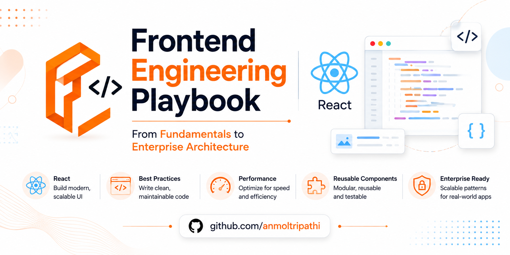

<p align="center">



# ⚛ React

### Engineering Playbook

**From Fundamentals to Enterprise Architecture**

*Build modern, scalable, and production-ready React applications.*

---


</p>

---

# Welcome

React has become the industry standard for building modern web applications.

Whether you're creating a personal portfolio, an enterprise dashboard, an e-commerce platform, or a SaaS application, React provides the flexibility and ecosystem needed to build scalable user interfaces.

This section of the **Engineering Playbook** is designed to help you progress from learning your first React component to designing enterprise-grade React architectures used in production.

This is not just a React tutorial.

It's a structured learning path focused on understanding **how React works**, **why it works**, and **how experienced engineers build maintainable applications**.

---

# Why Learn React?

React is one of the most widely adopted frontend libraries because it enables developers to build complex user interfaces using reusable components and predictable rendering.

Learning React will help you:

- Build reusable component-based applications
- Create fast and interactive user interfaces
- Understand modern frontend architecture
- Work with the React ecosystem
- Improve frontend engineering skills
- Prepare for real-world development

---

# Who Is This For?

This guide is designed for:

- Beginners learning React for the first time
- JavaScript developers moving into frontend development
- Angular or Vue developers learning React
- Backend developers exploring frontend technologies
- Working professionals improving React skills
- Engineers building production applications

---

# What You'll Learn

By the end of this React journey, you'll be able to:

- Build reusable React components
- Understand React rendering
- Manage local and global state
- Work with APIs and asynchronous data
- Create reusable custom Hooks
- Optimize rendering performance
- Test React applications
- Build production-ready applications
- Design scalable frontend architectures

---

# Learning Roadmap

```text
React Fundamentals
        │
        ▼
Core Concepts
        │
        ▼
Hooks
        │
        ▼
Component Lifecycle
        │
        ▼
Component Patterns
        │
        ▼
State Management
        │
        ▼
Routing
        │
        ▼
Data Fetching
        │
        ▼
Forms
        │
        ▼
Performance
        │
        ▼
Testing
        │
        ▼
Production
        │
        ▼
Architecture
```

---

# Available now

| Module | Status | Start |
|--------|--------|-------|
| [React Fundamentals](01-react-fundamentals/README.md) | Ready | [Module README](01-react-fundamentals/README.md) |
| [Core Concepts](02-core-concepts/README.md) | Ready | [Module README](02-core-concepts/README.md) |
| [Hooks](03-hooks/README.md) | Planned | Scaffold only |

After Core Concepts, Hooks is the next planned module—not a dead end, but not written yet.

---

# Curriculum

| Module | Description | Status |
|---------|-------------|--------|
| [React Fundamentals](01-react-fundamentals/README.md) | Learn what React is, why it exists, and how to start building applications | Ready |
| [Core Concepts](02-core-concepts/README.md) | Understand JSX, Components, Props, State, Events, Rendering and Composition | Ready |
| [Hooks](03-hooks/README.md) | Master built-in Hooks and create reusable custom Hooks | Planned |
| Component Lifecycle | Learn how React renders, updates, and unmounts components | Planned |
| Component Patterns | Discover reusable patterns for building maintainable applications | Planned |
| State Management | Manage local, shared, and server state effectively | Planned |
| Routing | Build navigation and routing for single-page applications | Planned |
| Data Fetching | Work with REST APIs, GraphQL, caching, and asynchronous data | Planned |
| Forms | Build accessible forms with validation and file uploads | Planned |
| Performance | Optimize rendering, reduce re-renders, and improve application speed | Planned |
| Testing | Write unit, integration, and end-to-end tests | Planned |
| Production | Learn debugging, monitoring, deployment, logging, and production best practices | Planned |
| Architecture | Design scalable enterprise React applications | Planned |

---

# Recommended Learning Order

For the best learning experience, follow the modules in the order provided.

React concepts build upon one another, and later modules assume knowledge from earlier sections.

```text
01 → React Fundamentals

02 → Core Concepts

03 → Hooks

04 → Component Lifecycle

05 → Component Patterns

06 → State Management

07 → Routing

08 → Data Fetching

09 → Forms

10 → Performance

11 → Testing

12 → Production

13 → Architecture
```

---

# Prerequisites

Before starting React, you should be comfortable with:

- HTML
- CSS
- JavaScript (ES6+)
- Functions
- Objects
- Arrays
- DOM Basics
- Git (Recommended)

If you're new to JavaScript, complete the JavaScript documentation first before starting React.

---

# Learning Outcomes

## 🟢 Beginner

You'll be able to:

- Create React projects
- Build reusable components
- Work with Props and State
- Handle user interactions

---

## 🟡 Intermediate

You'll be able to:

- Build complete React applications
- Work with Hooks
- Manage application state
- Consume REST APIs
- Build reusable components

---

## 🟠 Advanced

You'll be able to:

- Optimize rendering performance
- Create reusable custom Hooks
- Write comprehensive tests
- Debug complex rendering issues

---

## 🔴 Production Ready

You'll be able to:

- Structure large applications
- Improve maintainability
- Monitor and debug production systems
- Apply React best practices

---

## ⚫ Architect

You'll be able to:

- Design scalable React architectures
- Build reusable design systems
- Define component boundaries
- Select appropriate state management solutions
- Make long-term architectural decisions

---

# Real-World Applications

React powers applications such as:

- Admin Dashboards
- CRM Systems
- E-Commerce Platforms
- SaaS Products
- Analytics Dashboards
- Learning Platforms
- Enterprise Applications
- Internal Business Tools

---

# Related Sections

- [Fundamentals](../../01-fundamentals/README.md)
- [Frontend](../README.md)
- [Docs index](../../README.md)
- [JavaScript Interview](../../../interview/javascript/README.md)
- [Learning Path](00-learning-path.md)

---

# Next Step

Ready to begin?

➡ **Start with:** [01 - React Fundamentals](01-react-fundamentals/README.md)

Build a strong foundation before moving to the more advanced modules.