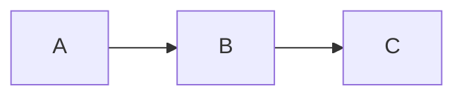

# Article Title

> **Article ID:** JS-FND-001
>
> **Module:** JavaScript
>
> **Category:** Fundamentals
>
> **Level:** Beginner
>
> **Reading Time:** 15 minutes

---

## Metadata

```yaml
---
id: JS-FND-001
title: What is JavaScript?
module: JavaScript
category: Fundamentals
level: Beginner
readingTime: 15 min
prerequisites:
  - None
tags:
  - javascript
  - fundamentals
status: Published
lastUpdated: YYYY-MM-DD
---
```

---

# Overview

Brief introduction.

Explain what the reader will learn.

---

# Why This Topic Matters

Explain why this concept exists.

What problem does it solve?

---

# Learning Objectives

After reading this article, you should be able to:

- Objective 1
- Objective 2
- Objective 3

---

# Prerequisites

Required knowledge.

---

# Core Concepts

Explain the theory.

---

# Internal Working

Explain how it works internally.

Include diagrams when helpful.

---

# Visual Diagram



---

# Syntax

```javascript
```

---

# Example 1

## Problem

Describe the problem.

### Code

```javascript
```

### Output

```text
```

### Explanation

Explain the solution.

---

# Example 2

Repeat.

---

# Real-world Use Cases

- Example 1
- Example 2
- Example 3

---

# Advantages

- Advantage
- Advantage

---

# Limitations

- Limitation
- Limitation

---

# Best Practices

✅ Recommendation

✅ Recommendation

---

# Common Mistakes

❌ Mistake

Why it happens.

How to avoid it.

---

# Performance Notes

Performance considerations.

---

# Security Notes

Security considerations.

---

# Browser Support

| Browser | Support |
|----------|----------|
| Chrome | ✅ |
| Firefox | ✅ |
| Safari | ✅ |
| Edge | ✅ |

---

# Interview Questions

## ⭐ Beginner

### Question

Answer

---

## ⭐⭐ Intermediate

Question

Answer

---

## ⭐⭐⭐ Advanced

Question

Answer

---

## ⭐⭐⭐⭐ Senior

Question

Answer

---

## ⭐⭐⭐⭐⭐ Architect

Question

Answer

---

# Exercises

## Easy

Exercise

---

## Medium

Exercise

---

## Hard

Exercise

---

## Challenge

Exercise

---

# Key Takeaways

- Point 1
- Point 2
- Point 3

---

# Related Articles

- Article 1
- Article 2
- Article 3

---

# References

## Official Documentation

-

## Specifications

-

## Additional Reading

-

---

# Changelog

| Version | Changes |
|----------|----------|
| 1.0 | Initial Version |